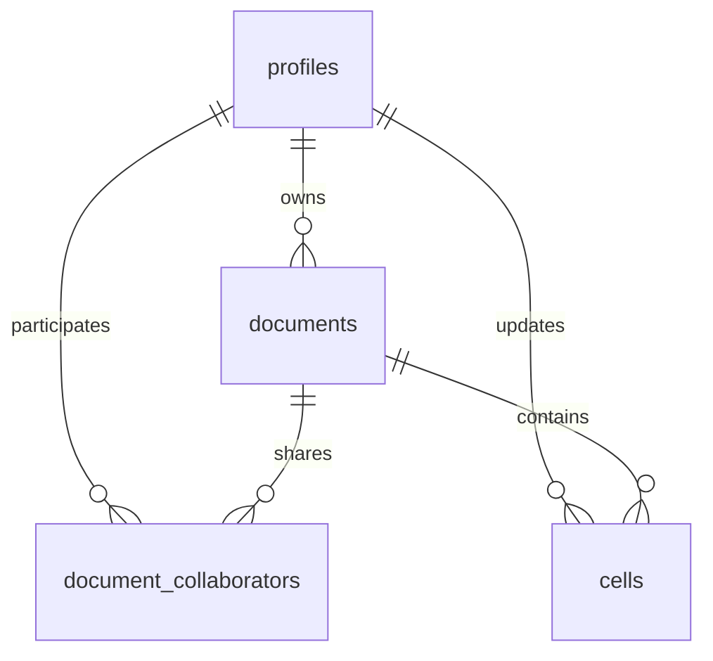

# CollabSheet

A real-time collaborative spreadsheet web application built with plain JS/ES modules, powered by Supabase (Postgres, Auth, Realtime, Presence) and bundled using Vite.

🔗 Live Demo: [collab-sheet-alpha.vercel.app](https://collab-sheet-alpha.vercel.app)

---

## ✨ Features

- **Real-time Collaboration**: Watch other users' active cell cursors and see edits appear live without page refreshes.
- **Row-Level Security (RLS)**: Enforced collaborator roles at the database layer (viewers can read but not write, editors and owners can edit).
- **Google & Anonymous Auth**: Sign in using your Google account or continue as a Guest using Supabase Anonymous Auth.
- **Formula Support**: Standard spreadsheet computations (e.g., `=SUM(A1:A10)`, simple cell references, and arithmetic expressions).
- **Spreadsheet Grid**: 50 rows × 26 columns with keyboard navigation (arrow keys, enter, delete).
- **Collaborator Management**: Share spreadsheets with other users using their User ID, assigning them Editor or Viewer roles.
- **Export to CSV**: Download your spreadsheet data directly.

---

## 🛠️ Tech Stack

- **Frontend**: Vanilla HTML5, CSS3, JavaScript (ES6 Modules)
- **Bundler & Server**: Vite
- **Backend & Persistence**: Supabase
  - **Database**: PostgreSQL (for tables, foreign keys, constraints)
  - **Auth**: Google OAuth + Anonymous Guest Sessions
  - **Realtime**: Postgres Changes Subscription (last-write-wins)
  - **Presence**: Decoupled cursor tracking and collaborator status broadcasts

---

## 🚀 Getting Started

### 1. Clone & Install
```bash
git clone https://github.com/anuj-k-bit/collab-sheet.git
cd collab-sheet
npm install
```

### 2. Configure Supabase
Create a `.env` file in the root directory:
```env
VITE_SUPABASE_URL=https://your-project.supabase.co
VITE_SUPABASE_ANON_KEY=your-anon-key
```

Make sure to enable **Anonymous Sign-in** in your Supabase Console (*Authentication* -> *Providers* -> *Anonymous*) and turn on **Realtime Replication** for the `cells` table (*Database* -> *Replication* -> *Source: supabase_realtime* -> *Tables*).

### 3. Run Database Migrations
Apply the SQL migration located at `supabase/migrations/20260619000000_init.sql` to your Supabase Postgres database.

### 4. Run Locally
```bash
npm run dev
```
Visit the local server address (typically `http://localhost:5173`) in your browser.

---

## 📁 Project Structure

```text
collab-sheet/
├── src/
│   ├── state.js      # Centralized application state
│   ├── formulas.js   # Formula calculations and cell key parsers
│   ├── auth.js       # Supabase Auth wrappers & profiles sync
│   ├── sync.js       # Supabase DB transactions, realtime, and presence
│   ├── ui.js         # DOM construction, rendering, and modal management
│   └── main.js       # Entry point, routing, and event bootstrapping
├── supabase/
│   └── migrations/   # Database schemas and RLS definitions
├── index.html        # Main HTML layout
├── package.json      # Dependencies and Vite scripts
├── vercel.json       # Deployment configuration
└── README.md         # Documentation
```

---

## 🏗️ Architecture & Database Schema

CollabSheet uses four main tables in PostgreSQL with Row-Level Security (RLS) policies to ensure secure real-time collaboration.

### Schema Design

1. **`profiles`**
   - Stores user-facing display names and cursor colors.
   - Maps 1:1 to Supabase's `auth.users` schema.

2. **`documents`**
   - Stores spreadsheet metadata (owner, title, created/updated timestamps).

3. **`document_collaborators`**
   - Direct junction table mapping `doc_id` to `user_id` (`profiles`).
   - Restricts document access to specified roles (`owner`, `editor`, `viewer`).

4. **`cells`**
   - Stores cell content, formulas, styles, and modification metadata.
   - Unique constraint on `(doc_id, cell_key)` ensures upserts are clean.



### Row-Level Security (RLS)

Security is handled via a PostgreSQL security definer helper function `is_collaborator(doc_id, user_id)` which runs with superuser privileges to bypass circular table references during policy evaluation:

- **Documents & Cells (Select)**: Only accessible if `is_collaborator(doc_id, auth.uid())` returns `true`.
- **Collaborator Management**: Restricted entirely to the document owner (`documents.owner_id = auth.uid()`).
- **Cell Edits (Insert/Update/Delete)**: Restrained to the document owner or users in `document_collaborators` with the `owner` or `editor` role. Viewers are blocked from modifying cell data.

### Sync & Recalculation Approach

- **Live Edits**: The app subscribes to the Supabase Realtime channel filtering `cells` changes by `doc_id`. When another collaborator updates a cell, a `postgres_changes` event fires, updating the local cell cache.
- **Formula Sync**: On remote updates, the entire grid re-evaluates. If cell `A1` is modified by User A, User B's browser automatically recalculates cell `B2` (containing `=SUM(A1:A5)`) immediately.
- **Presence Cursors**: The app tracks each client's cursor cell, color, and display name using a Supabase Presence channel. As a user navigates, their cursor position is broadcasted to active peers.
